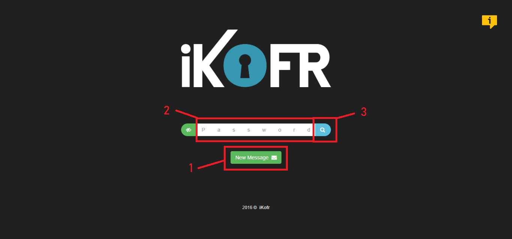
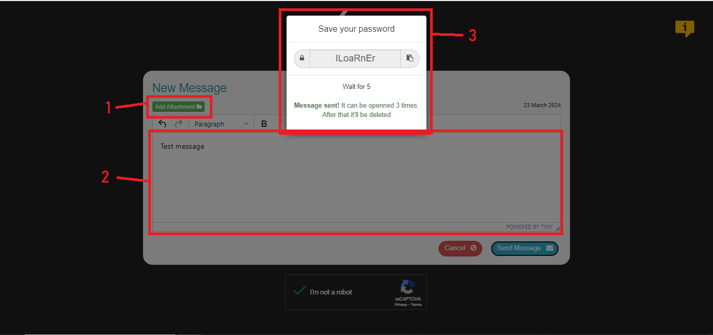

<h1>Ikofr</h1>

IKofr is a project built with the CodeIgniter Framework, designed for sending messages anonymously.

* All messages are encrypted.

* Messages are automatically deleted from the database after 3 days.

* Each message can be accessed a maximum of 3 times before being permanently deleted.

* The platform allows for the transmission of files up to 5 MB in size.

1 - Create a new message.

2 - Password of a previously created message.

3 - Search for message.

1 - Attachment of the message.

2 - Field to write a message.

3 - Password generated after sending the message.

Note: The database dump is located in the "db_dump" folder.

